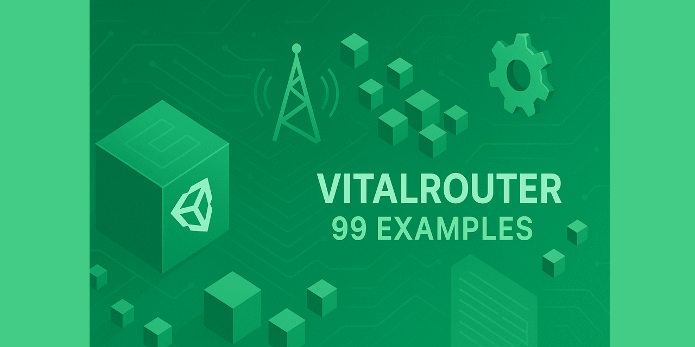

# 🚀 VitalRouter Integration Guide and sandbox for Unity

## 📦 Install VitalRouter
- Use official instruction on https://github.com/hadashiA/VitalRouter
- You can follow commit messages from version history to see the affect of each step.

### Shortly:
- Install UniTask ( Package manager, via git URL: https://github.com/Cysharp/UniTask.git?path=src/UniTask/Assets/Plugins/UniTask )
- Install VitalRouter ( Package manager, via git URL: https://github.com/hadashiA/VitalRouter.git?path=/src/VitalRouter.Unity/Assets/VitalRouter#1.6.5 )

## Examples
- Example.00 - No VitalRouter
- Example.01 - Simple Event Handler
- Example.02 - Sequential Control
- Example.03 - Event Handler Order, Event Chain
